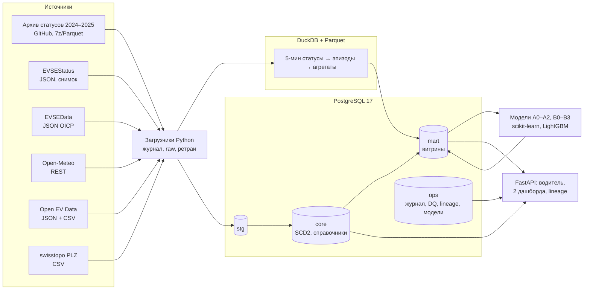

# EV Charge Advisor CH

Информационная система управления данными зарядной инфраструктуры электромобилей Швейцарии с интеграцией метеорологических данных.

Система собирает открытые данные о зарядных станциях, их статусах и погоде и ведёт хранилище со слоями raw → staging → core → mart. Она контролирует качество и происхождение данных, прогнозирует загрузку сети и помогает водителю выбрать станцию: с подходящим разъёмом, нужной мощностью и высокой вероятностью свободной точки к моменту приезда.

Это общий проект для трёх работ: итоговый проект по дисциплине «Прогнозно-аналитические системы» (профиль «Управление данными»), курсовая работа по ПСУД и выпускная квалификационная работа (РТУ МИРЭА, ИНБО-20-23, Бражкин А.А.). Проектное решение описано в [docs/DESIGN.md](docs/DESIGN.md). Предшественник проекта — [evcharge-ch-forecast](https://github.com/yandhi2018/evcharge-ch-forecast) (сбор данных, сентябрь 2026).

## Что умеет

| Пользователь | Страница | Чем помогает |
|---|---|---|
| Водитель | `/` | Выбрать автомобиль и место (адрес, геолокация или клик на карте). Получить до 5 станций на карте и в списке с объяснением: какой разъём подходит, какая будет мощность, сколько ехать, какова вероятность свободной точки к приезду |
| Аналитик инфраструктуры | `/analytics` | Увидеть, где и когда сеть загружена, сравнить прогноз загрузки на сутки с фактом, оценить влияние погоды, долю неисправных точек и точность моделей |
| Инженер данных | `/operations` | Проверить успешность и свежесть загрузок, результаты проверок качества, изменения структуры источников и справочника, карантин, калибровку модели |
| Все | `/lineage` | Проследить происхождение показателя: от дашборда до исходного источника |

## Архитектура



| Слой | Где | Ответственность |
|---|---|---|
| raw | `data/raw/<источник>/` + `ops.raw_manifest` | Неизменяемые копии ответов источников с sha256 |
| staging | `stg.*`, `data/lake/stg/` | Типы, единые коды, дедупликация, 1:1 к источнику |
| core | `core.*`, `data/lake/core/` | Справочники (кантоны, операторы, станции, разъёмы, автомобили), SCD2-история точек, погода, снимки статусов |
| mart | `mart.*` | Загрузка по часам, профили, прогнозы, метрики моделей, полнота архива |
| ops | `ops.*` | Журнал загрузок, версии схемы, структуры источников, проверки качества, карантин, lineage, реестр моделей |

Стек и его обоснование — в [DESIGN.md, раздел 3](docs/DESIGN.md):
- Python 3.12;
- PostgreSQL 17: ограничения, функции, процедуры, триггеры, роли;
- DuckDB + Parquet для 3 млрд строк архива;
- FastAPI, Leaflet, Plotly;
- scikit-learn, LightGBM;
- pytest, ruff, GitHub Actions.

## Установка

Нужно: Windows 10/11 (или Linux/macOS), Python 3.12, Git и Docker Desktop. Если Docker нет, подойдёт установленный PostgreSQL 16/17. Для архива нужно около 15 ГБ на диске и 8 ГБ ОЗУ.

```powershell
git clone https://github.com/yandhi2018/ev-charge-advisor-ch.git
cd ev-charge-advisor-ch
py -3.12 -m venv .venv
.venv\Scripts\python -m pip install -e ".[dev]"

# База: контейнер postgres:17, роль ev_admin, база evadvisor; пароли генерируются в .env
powershell -ExecutionPolicy Bypass -File scripts\init_db.ps1
.venv\Scripts\evadvisor db migrate
```

Режим без Docker: в `.env` укажите `PG_MODE=local` и `PG_PORT=5432`. Тогда `init_db.ps1` спросит пароль суперпользователя `postgres`; пароль нигде не сохраняется.

## Запуск

```powershell
# Первый полный цикл: все источники, архив (~1 ч), витрины, проверки качества, обучение моделей
.venv\Scripts\evadvisor run-all --with-archive --with-train

# Веб-приложение: http://127.0.0.1:8000
.venv\Scripts\evadvisor serve
```

Дальше достаточно `evadvisor run-all`: каждый загрузчик догружает только новое, а повторный запуск ничего не дублирует. Для ежедневной догрузки по расписанию выполните `scripts\register_tasks.ps1`: задача Планировщика Windows запускается раз в день, при включённом ПК. Текущий снимок статусов приложение получает само при каждом поиске, не чаще раза в 5 минут.

| Команда | Что делает |
|---|---|
| `evadvisor ingest postal / evse-data / vehicles / weather / status / archive` | Загрузка одного источника |
| `evadvisor ingest all` | Все источники; сбой одного не останавливает остальные |
| `evadvisor transform` | Витрина по живым снимкам, синхронизация lineage, проверки качества |
| `evadvisor quality` | Только проверки качества (`config/dq_checks.yaml`) |
| `evadvisor train --task canton/availability/all` | Обучение и временная валидация моделей |
| `evadvisor db migrate` / `db reset --yes` | Применить или пересоздать схему БД |
| `pytest` | Тесты: разбор источников, роли и права, триггеры, ограничения, идемпотентность |

Конфигурация: `config/config.yaml` (адреса источников, периоды, параметры моделей и рекомендателя), `config/dq_checks.yaml` (проверки качества), `config/lineage.yaml` (граф происхождения), `.env` (пароли и пути, в git не попадает).

## Свойства загрузки

| Источник | Инкрементальность | Идемпотентность | При сбое |
|---|---|---|---|
| Архив статусов | Только необработанные месяцы | Месяц + sha256 файла; витрина месяца перезаписывается целиком | Месяц помечается failed, остальные продолжаются; повтор при нехватке памяти |
| EVSEData | Выгрузка с тем же хэшем пропускается | (EvseID, хэш значимых полей) → SCD2 | Действует предыдущая версия справочника; частичная выгрузка не деактивирует точки |
| EVSEStatus | Один снимок на 5-минутный слот | (слот, EvseID) | Приложение берёт последний снимок или исторический профиль |
| Погода | От последнего загруженного часа по каждому кантону | (кантон, час, вид) — upsert | Ошибка одного кантона не останавливает остальные (status = partial) |
| Каталог ЭМ, индексы | Пропуск при неизменном хэше | Естественные ключи | Действует предыдущая версия |

Во всех источниках: повторные попытки с экспоненциальной паузой, учёт HTTP 429 и Retry-After, таймауты, атомарная запись файлов, журнал `ops.load_run`. Записи-нарушители уходят в карантин `ops.quarantine`.

## Данные и лицензии

| Источник | Лицензия / условия |
|---|---|
| BFE, ich-tanke-strom.ch — статусы и паспорта точек (data.geo.admin.ch, opendata.swiss) | Открытое использование с указанием источника |
| [Swiss-public-charging-dataset](https://github.com/rudolphsanta/Swiss-public-charging-dataset), R. Santarromana — архив статусов 2022–2025 | Лицензия не указана; первоисточник BFE, указываются оба |
| [Open-Meteo](https://open-meteo.com/) | CC BY 4.0 |
| [Open EV Data](https://github.com/KilowattApp/open-ev-data), KilowattApp | MIT с обязательным указанием источника |
| swisstopo, Amtliches Ortschaftenverzeichnis | Открытые данные swisstopo |
| OpenStreetMap (подложка карты) | ODbL |

Персональные данные не собираются: координаты водителя в журнале запросов огрубляются до ~1 км.

## Структура репозитория

```
config/          конфигурация, каталог проверок качества, граф lineage, собственный каталог ЭМ
db/              SQL: 00 схемы, 01 таблицы, 02 справочники, 03 запросы, 04 функции, 05 процедуры,
                 06 триггеры, 07 роли; duckdb/ — обработка архива
docs/            проектное решение, словарь данных (генерируется из БД)
scripts/         init_db.ps1, register_tasks.ps1
src/evadvisor/   ingestion/ загрузчики, models/ модели, web/ приложение, recommender, quality, lineage, migrate, cli
tests/           pytest
docker-compose.yml  PostgreSQL 17
```
