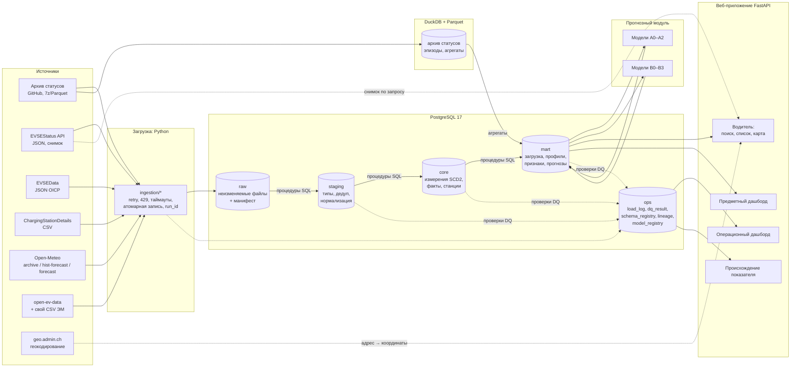

# Проектное решение: EV Charge Advisor CH

Версия 0.2 от 02.10.2026. Согласовано с автором, по ходу работы допускаются уточнения.

**Изменение в 0.2.** Методички ПСУД (ПР1–ПР9) требуют реляционную БД с внешними ключами, CHECK, UNIQUE, функциями, процедурами, триггерами и ролями GRANT/REVOKE. Также нужны скрипты `01_create_tables.sql` … `07_roles.sql`. Поэтому основная БД системы — **PostgreSQL 17**, он уже установлен. DuckDB остаётся вычислительным движком только для тяжёлого архива статусов (Parquet, миллиарды строк). dbt исключён: преобразования оформлены SQL-процедурами PostgreSQL, что одновременно закрывает ПР8 ПСУД.

Тема (общая для ПАС, курсовой по ПСУД и ВКР): **«Проектирование информационной системы управления данными зарядной инфраструктуры электромобилей с интеграцией метеорологических данных»**.

---

## 0. Ключевые решения

| Вопрос | Решение |
|---|---|
| Ядро системы | ИС управления данными: слои raw → staging → core → mart и сквозной ops (журнал, качество, метаданные, история) |
| Потребители ядра | (1) приложение водителя с рекомендациями ЭЗС; (2) предметный дашборд аналитика; (3) операционный дашборд инженера данных |
| Прогноз A (официальный показатель ПАС, не меняется) | Почасовая загрузка точек по кантону и классу мощности, горизонт 1–24 ч |
| Прогноз B (для водителя) | Вероятность, что точка свободна через Δ = 5…60 мин при известном текущем статусе |
| Хранилище | PostgreSQL 17: схемы raw, stg, core, mart, ops; роли и права. DuckDB + Parquet: только архив статусов и обучающие выборки, агрегаты записываются в PostgreSQL |
| Преобразования и качество | SQL-скрипты `db/01…07_*.sql` (таблицы, данные, запросы, функции, процедуры, триггеры, роли), применяются мигратором с журналом версий; процедуры stg → core → mart; проверки качества описаны в YAML, результаты в `ops.dq_result` |
| Веб | FastAPI + Jinja2 + Leaflet (карта) + Plotly (графики). Одно приложение: водитель, два дашборда, страница происхождения данных |
| Расстояние | MVP: по прямой × 1,3 и средняя скорость. Этап 2: OSRM в Docker, маршрут на карте |
| Погода | Признак обеих моделей и предупреждение «в мороз DC-зарядка медленнее» |
| Каталог ЭМ | open-ev-data (MIT) + собственный CSV с ~30 популярными в Швейцарии моделями и ссылками на спецификации |
| Непрерывный сбор | Не требуется. Модели учатся на архиве; текущий статус берётся по запросу в момент поиска |
| Запуск | Локально: `evadvisor run-all`, затем `evadvisor serve`; ежедневная догрузка через Планировщик Windows (если ПК включён) |

---

## 1. Один проект для трёх работ

```
                ┌───────────────────────────────────────────────┐
                │  ИС управления данными (общее ядро)           │
                │  источники → raw → staging → core → mart      │
                │  ops: журнал, DQ, схемы, lineage, SCD2        │
                └───────┬───────────────┬───────────────┬───────┘
                        │               │               │
              прогнозный модуль   приложение водителя   дашборды
              (модели A и B)      (рекомендатель)       (предметный, операционный)
```

| Работа | Акцент | Срок | Что берёт из проекта |
|---|---|---|---|
| ПАС (профиль УД) | Полный цикл данных и прогноз, 100 баллов по критериям | показ до конца ноября 2026 | Весь прототип, отчёт, презентация |
| Курсовая по ПСУД | Проектирование ИС управления данными | конец ноября / декабрь 2026 (уточнить) | Требования, модели данных (концептуальная, логическая, физическая), архитектура, обоснование СУБД, качество и метаданные |
| ВКР | Та же тема в полном объёме | весна 2027 | Всё перечисленное, плюс формальное ТЗ, UML, бэктест рекомендателя, тестирование, экономическое обоснование, руководство пользователя |

Пользователи системы:
- **водитель электромобиля**, основной пользователь приложения;
- **аналитик зарядной инфраструктуры**, пользователь предметного дашборда (уже согласован в отчёте ПАС);
- **инженер данных**, пользователь операционного дашборда.

---

## 2. Постановка задачи прогноза

### 2.1 Данные для обучения

- Архив статусов: 2024-01 … 2025-12, шаг 5 мин. В 2024-10 данные неполные, 2024-12 пустой. Первая проверка после загрузки: почему месяцы 2025 года весят в 2,5 раза меньше 2024-х (сменился формат, точек стало меньше или реже фиксировались изменения).
- Погода: Open-Meteo Archive для фактической погоды, **Historical Forecast API** для архивных прогнозов, Forecast API для текущих прогнозов.
- Календарь: праздники Швейцарии и кантонов из библиотеки `holidays` (офлайн).

### 2.2 Прогноз A: загрузка по кантонам (официальный показатель ПАС)

- **Цель:** `occupancy_rate(кантон, класс, час) = Occupied / (Available + Occupied)`. Статусы OutOfService и Unknown в знаменатель не входят и считаются отдельным показателем технического состояния.
- **Горизонт:** 1–24 ч от момента прогноза t0.
- **Признаки** (только известные к t0): значения показателя на t0, t0−1 ч, t0−2 ч; значение того же часа сутки и неделю назад относительно цели; скользящее среднее за 24 ч; горизонт h; час, день недели, праздник; погода на целевой час.
- **Модели:**
  - A0 сезонный наивный прогноз (значение неделю назад);
  - A1 средний профиль «кантон × класс × день недели × час», рассчитанный только по обучающему окну;
  - A2 LightGBM, одна глобальная модель на все кантоны с горизонтом как признаком;
  - (опционально) A3 Ridge-регрессия как интерпретируемая линейная модель.
- **Метрики:** MAE и RMSE в процентных пунктах загрузки, MASE относительно A0. Все метрики дополнительно по горизонтам 1, 6, 24 ч и по классам мощности. Пример интерпретации: «MAE = 3 п. п.: на кантоне с 200 точками ошибка около 6 занятых точек».
- **Валидация (rolling origin, расширяющееся окно):**

  | Фолд | Обучение | Зазор | Тест |
  |---|---|---|---|
  | 1 | 2024-01 … 2025-05 | 7 дней | 2025-06 … 2025-07 |
  | 2 | 2024-01 … 2025-07 | 7 дней | 2025-08 … 2025-09 |
  | 3 | 2024-01 … 2025-09 | 7 дней | 2025-10 … 2025-12 |

- **Защита от утечек:**
  1. Профили и target encoding считаются только на обучающем окне фолда.
  2. Лаги не заглядывают за t0.
  3. Зазор 7 дней покрывает лаг 168 ч.
  4. Гиперпараметры подбираются на хвосте обучающего окна, а не на тесте.
  5. На тесте используется **архивный прогноз погоды**, а не фактическая погода. Отдельный эксперимент сравнивает «факт» и «прогноз», чтобы показать, сколько оптимизма даёт фактическая погода.
- **Пропуски:** целевая переменная не восстанавливается. Часы без данных исключаются из обучения и метрик. Лаги, попадающие на пропуск, остаются NaN (LightGBM их обрабатывает). Если для A0 нет значения неделю назад, используется A1.

### 2.3 Прогноз B: вероятность свободной точки к прибытию (для водителя)

- **Цель:** `y = 1`, если точка в статусе Available в момент t0 + Δ, где Δ ∈ {5, 10, …, 60} мин, а t0 — момент запроса водителя.
- **Обучающая выборка:** из архива случайно выбираются пары (точка, t0) с шагом 15 мин, около 0,5–1 % всех пар (порядка 10 млн строк); Δ выбирается равномерно. Состав выборки фиксируется seed.
- **Признаки.** Используются только данные, которые будут доступны при работе приложения:
  - текущий статус точки, число свободных и всего точек на станции сейчас;
  - Δ, час прибытия, день недели, праздник;
  - класс мощности, кВт, типы разъёмов, размер станции, оператор (топ-N, остальные в «прочие»), кантон;
  - исторический профиль «доля времени свободна» для точки на (день недели, час прибытия), рассчитанный только по обучающему окну. Для новых точек используется цепочка запасных профилей: станция → кантон × класс → класс;
  - погода на час прибытия (прогноз).
- **Исключённый признак: длительность текущего статуса.** В архиве она есть, но API текущего статуса отдаёт снимок без времени. Признак дал бы расхождение между обучением и работой приложения (train/serve skew).
- **Модели:**
  - B0 «статус не изменится» (persistence): P = 0,95, если точка свободна сейчас, иначе 0,05;
  - B1 исторический профиль;
  - B2 марковская модель переходов: P(статус → Available за Δ) по (класс мощности, интервал часов, текущий статус). Интерпретируемая и показательная для защиты;
  - B3 LightGBM-классификатор с изотонической калибровкой на валидационном окне.
- **Метрики:** Brier score (основная), log loss, ROC-AUC, ECE и диаграмма надёжности. Все метрики отдельно для случаев «сейчас занята» и «сейчас свободна»: первый случай самый интересный.
- **Валидация:** обучение 2024-01 … 2025-06, валидация (калибровка, гиперпараметры) 2025-07 … 2025-09, тест 2025-10 … 2025-12, зазор 1 день между окнами.
- **Вероятность для станции:** P(хотя бы одна совместимая точка свободна) = 1 − Π(1 − pᵢ). Формула предполагает независимость точек, поэтому её калибровка на уровне станции проверяется на бэктесте. При систематической ошибке добавляется калибратор на уровне станции.

### 2.4 Итоговая метрика рекомендателя (бэктест)

На тестовом периоде генерируются запросы со случайным местом в населённых пунктах, случайным автомобилем и случайным t0. Для каждого рекомендатель выдаёт станцию, а факт берётся из архива на момент t0 + ETA.

- **Hit@1:** у станции на первом месте есть свободная совместимая точка к моменту прибытия. Также считается Hit@3.
- Среднее ожидаемое и фактическое время до начала зарядки.
- Сравнение трёх стратегий: «ближайшая совместимая», «ближайшая со свободной точкой сейчас», «наша модель».

Это главный измеримый результат для защиты и ВКР.

---

## 3. Архитектура

### 3.1 Схема



### 3.2 Стек и обоснование

| Компонент | Выбор | Почему | Отклонено |
|---|---|---|---|
| Язык | Python 3.12 | Один язык для загрузки, ML и веба. 3.12: у всех библиотек стабильные колёса под Windows | — |
| Основная БД | PostgreSQL 17 (локально) | Ограничения целостности, функции, процедуры, триггеры, роли и GRANT. Это требования ПСУД, и они же дают серверную логику для ПАС. Уже установлен | DuckDB как основная БД: нет триггеров, процедур и ролей |
| Аналитический движок | DuckDB + Parquet | Архив 2024–2025 (миллиарды 5-минутных строк) обрабатывается колоночным движком по месяцам. В PostgreSQL уходят только эпизоды статусов, почасовые агрегаты и профили | Загрузка 5-минутного архива целиком в PostgreSQL: сотни ГБ, часы на загрузку |
| Преобразования | SQL-процедуры PostgreSQL + скрипты DuckDB | Слои и зависимости видны прямо в SQL; мигратор применяет `db/*.sql` по порядку и пишет `ops.schema_version` (управление изменением схемы) | dbt: третий инструмент, а триггеры, процедуры и роли он всё равно не закрывает |
| Загрузка | requests, py7zr, pyarrow | Распаковка 7z на Python без внешнего 7-Zip | — |
| ML | scikit-learn, LightGBM | Стандарт, быстро на CPU | Нейросети: избыточны |
| Веб | FastAPI + Jinja2 + Leaflet + Plotly + Pico.css | Без сборки на Node; карта, геолокация браузера и клики на карте работают нативно; дашборды — серверные HTML-страницы с фильтрами в GET-параметрах | Streamlit: неудобна карта и геолокация, интерфейс водителя ограничен. Metabase: Java-сервер и плагин DuckDB |
| Геокодирование | api3.geo.admin.ch SearchServer | Бесплатно, без ключа, официальные адреса Швейцарии | Nominatim: строгие лимиты |
| Карта | OSM-тайлы (или swisstopo WMTS) | Бесплатно | — |
| Маршрут | Этап 1: по прямой × 1,3. Этап 2: OSRM в Docker | Docker установлен, карта Швейцарии ~0,5 ГБ | Облачные API маршрутизации |
| Оркестрация | CLI на Typer + Планировщик Windows | Просто и прозрачно, догрузка «с последнего успешного» | Airflow, Prefect: избыточны для одного ПК |
| Качество кода | pytest, ruff, GitHub Actions на `data/sample` | CI зелёный без больших данных | — |

### 3.3 Слои и ответственность

| Слой | Где | Ответственность | Чего в слое нет |
|---|---|---|---|
| raw | Файлы `data/raw/<источник>/…` (как получены) + `ops.raw_manifest` | Неизменяемая копия ответа источника, хэш, run_id; позволяет переобработать данные | Никаких изменений файлов |
| staging | PostgreSQL `stg.*`; для архива — Parquet в `data/lake/stg/` | Типы, переименование, единые коды статусов и разъёмов, UTC, дедупликация 1:1 к источнику | Бизнес-логика и объединения |
| core | PostgreSQL `core.*` (справочники, SCD2, погода, живые снимки); архив — `data/lake/core/status_episode/month=…` | Интегрированная модель: измерения (SCD2), разрешение станций, факты статусов и погоды | Расчёты под конкретного потребителя |
| mart | PostgreSQL `mart.*` | Витрины под потребителей: загрузка, профили, прогнозы, метрики, кандидаты для рекомендателя | Сырые данные |
| ops | PostgreSQL `ops.*` | Журнал загрузок, результаты проверок, версии схемы, реестр схем источников, lineage, реестр моделей | — |

Роли БД (ПР9 ПСУД): `ev_driver_app` (чтение витрин, вызов функции рекомендаций, запись журнала запросов), `ev_analyst` (чтение mart и метрик), `ev_engineer` (загрузка и преобразования, чтение ops), `ev_admin` (владелец схем). Веб-приложение подключается к разделам под разными ролями: страницы водителя под `ev_driver_app`, предметный дашборд под `ev_analyst`, операционный под `ev_engineer`. Так разграничение доступа работает в самом прототипе, а не только в отчёте.

### 3.4 Потоки, инкрементальность, идемпотентность

| Поток | Когда | Инкрементальность | Ключ идемпотентности | Поведение при сбое |
|---|---|---|---|---|
| F1 архив статусов | Разово и по месяцам | Загружаются только отсутствующие месяцы из конфига | (месяц, sha256 файла) | Повтор с паузой; сбой месяца не останавливает остальные, статус запуска «частично» |
| F2 справочник EVSEData + CSV | Ежедневно, если ПК включён | Сравнение хэша выгрузки; в SCD2 идут только изменившиеся точки | (evse_id, хэш содержимого) | Действует предыдущая версия |
| F3 погода | Ежедневно, архив догружается «с последнего дня»; прогноз запрашивается при поиске с кэшем на 1 ч | По (кантон, последний час) | (кантон, час, тип: факт или прогноз, дата выпуска) | Ошибка по одному кантону не останавливает остальные |
| F4 текущий статус | При поиске водителя, кэш 5 мин | 5-минутный слот | (слот, evse_id) | Последний снимок с пометкой «данные N мин назад»; если снимка нет, используется только профиль |
| F5 каталог ЭМ | Вручную или при запуске | Хэш файла | (vehicle_id, версия) | — |
| F6 преобразования (`evadvisor transform`) | После F1–F5 | Процедуры обрабатывают только записи новых run_id; архив обрабатывается по месяцам | Пересчёт месяца или run_id даёт тот же результат (DELETE + INSERT в транзакции) | Ошибка severity=error останавливает продвижение в core: данные уходят в карантин |
| F7 обучение | Вручную / раз в месяц | — | (модель, хэш данных, seed) | Действующая версия модели остаётся |

Каждый запуск пишет строку в `ops.load_log` в начале и обновляет её в конце. Это решение перенесено из старого проекта.

---

## 4. Модель данных (core и mart)

### 4.1 Измерения

| Таблица | Ключ | Основные атрибуты | Особенности |
|---|---|---|---|
| `core.dim_canton` | canton_code | название, центр (lat, lon) для погоды | 26 строк, `db/02_insert_data.sql` |
| `core.dim_operator` | operator_id | название, страна | Из EVSEData |
| `core.dim_station` | station_key (суррогатный) | нормализованный адрес, lat, lon, canton_code, operator_id, is_24h, доступ | **Разрешение сущностей:** ChargingPoolID пуст, поэтому точки группируются по нормализованному адресу и близости координат (≤ 30 м). Правило и спорные случаи пишутся в `ops.entity_resolution_log` |
| `core.dim_evse` (SCD2) | evse_sk; бизнес-ключ evse_id | station_key, мощность кВт, тип тока AC/DC, класс мощности, valid_from, valid_to, is_current, row_hash | **Историзация:** процедура `sp_apply_evse_snapshot` сравнивает row_hash; триггер закрывает старую версию и пишет новую |
| `core.bridge_evse_plug` | (evse_id, plug_code) | needs_own_cable | Разъёмы точки |
| `core.dim_plug` | plug_code | Каноническое имя: TYPE2_SOCKET, TYPE2_CABLE, CCS2, CHADEMO, TYPE1, T13 … | Отображение OICP → каноническое имя хранится в seed-файле; новое неизвестное значение → предупреждение DQ |
| `core.dim_vehicle` | vehicle_id | марка, модель, вариант, год, ac_max_kw, dc_max_kw, ёмкость кВт·ч, источник | open-ev-data + свой CSV; при пересечении приоритет у своего CSV |
| `core.bridge_vehicle_plug` | (vehicle_id, plug_code) | — | — |
| `core.dim_calendar` | date_ch | день недели, праздник CH, праздники кантонов (список) | Из `holidays` |

### 4.2 Факты

| Таблица | Зерно | Атрибуты | Объём |
|---|---|---|---|
| `core.fct_status_episode` | (evse_id, status, valid_from) | valid_to, source (архив или живые данные), run_id | Сжатие 5-минутного ряда в интервалы постоянного статуса: в десятки раз меньше строк. Хранится в Parquet по месяцам |
| `core.fct_status_snapshot_live` | (slot_5min, evse_id) | статус, run_id | Снимки, сделанные при поисках |
| `core.fct_weather_hourly` | (canton_code, hour_utc, kind, issued_at) | temp, precip, snowfall, wind | kind: actual / hist_forecast / forecast |

### 4.3 Витрины

| Витрина | Зерно | Назначение |
|---|---|---|
| `mart.occupancy_hourly` | кантон × класс × час | Показатель A, покрытие часа данными, доля OutOfService |
| `mart.evse_profile` | evse × день недели × час | Доля времени свободна (признак B1/B3, запасные профили) |
| `mart.train_canton`, `mart.train_evse` | — | Обучающие выборки с зафиксированной версией |
| `mart.forecast_canton` | t0 × кантон × класс × h × модель | Прогноз A, факт и интервал |
| `mart.model_metrics` | модель × фолд × метрика × срез | Метрики для дашбордов и отчёта |
| `mart.station_candidates` | станция × совместимая группа разъёмов | Готовые данные для рекомендателя: мощность, разъёмы, координаты, профиль |
| `mart.recommendation_log` | запрос | Время, автомобиль, координаты, **огрублённые до ~1 км**, выдача, версия модели. Нужен для мониторинга, персональных данных не содержит |

### 4.4 Служебный слой ops

| Таблица | Содержание |
|---|---|
| `ops.load_log` | run_id, источник, начало и конец, статус (success / skipped / partial / failed), параметры, HTTP-код, число попыток, хэш, путь к raw-файлу, строки получено, записано, дубли, текст ошибки |
| `ops.raw_manifest` | Файл, sha256, размер, run_id, время |
| `ops.dq_result` | run_id, проверка, слой, таблица, тип (полнота, уникальность, допустимость, типы, диапазон, ссылочная целостность, актуальность), severity, итог, число нарушений, пример |
| `ops.schema_registry` | Источник, хэш набора полей, список полей, first_seen и last_seen. Новое или пропавшее поле фиксируется и показывается на операционном дашборде |
| `ops.lineage_edge` | Ребро графа «источник → загрузка → raw → stg → core → mart → показатель → элемент дашборда». Строится из `config/lineage.yaml` (описание загрузчиков, процедур, витрин, показателей и элементов дашбордов) и связывается с фактическими run_id |
| `ops.model_registry` | Модель, версия, хэш обучающих данных, параметры, метрики, путь к артефакту, активная или нет |

---

## 5. Рекомендатель: модули

```
запрос (координаты, автомобиль, сколько зарядить, фильтры)
  │
  ├─ 1. candidates     станции в радиусе R (по умолчанию 15 км; если найдено меньше 5, радиус до 50 км)
  ├─ 2. compatibility  жёсткий фильтр: разъёмы авто ∩ разъёмы точки;
  │                    TYPE2_SOCKET — только если у водителя есть свой кабель (по умолчанию да);
  │                    не OutOfService сейчас; фильтры водителя
  ├─ 3. power          P_eff = min(P_точки, AC_max авто) или min(P_точки, DC_max авто);
  │                    при t° < 0 °C и DC — пометка «мощность может быть ниже»
  ├─ 4. eta            этап 1: d = haversine × 1,3; t = d / v (v из конфига: 35 км/ч до 5 км, 60 км/ч дальше)
  │                    этап 2: OSRM table (время), OSRM route (линия на карте)
  ├─ 5. availability   текущий снимок (API, кэш 5 мин) + погода + модель B → pᵢ для каждой совместимой точки
  │                    P_станции = 1 − Π(1 − pᵢ)
  ├─ 6. scoring        ожидаемое время до получения E кВт·ч:
  │                    T = t_пути + (1 − P_станции) · t_ожидания + 60 · E / P_eff
  │                    (t_ожидания по умолчанию 20 мин, берётся из конфига)
  │                    сортировка по T, выдача топ-5
  └─ 7. explain        шаблонный текст из компонентов T
```

Почему ранжирование по времени: время в минутах водитель понимает без пояснений, а вклад каждого фактора (дорога, риск ожидания, скорость зарядки) видно по его слагаемым. Взвешенная сумма разнородных величин так не объясняется.

Пример объяснения:
> **Migros Bern Westside, 4,1 км, ~8 мин в пути.** Подходит разъём CCS. Ваш авто примет до 135 кВт, здесь доступно 150 кВт. Вероятность свободной точки к приезду: 82 % (сейчас свободно 3 из 4). 20 кВт·ч займут ~9 мин. Итого ≈ 21 мин.

Запасные режимы:
- API статусов недоступен → используется последний снимок с пометкой его возраста; если снимка нет, считается только профиль (B1) и появляется надпись «без данных реального времени».
- Точка новая и отсутствует в архиве → используется запасной профиль.
- Геокодер недоступен → водитель выбирает место кликом на карте или через геолокацию.

---

## 6. Макеты экранов

### 6.1 Водитель: поиск (главная страница)

```
┌──────────────────────────────────────────────────────────────────┐
│ ⚡ Где зарядиться                          Аналитика · Данные    │
├──────────────────────────────────────────────────────────────────┤
│ Ваш автомобиль   [ Tesla Model 3 LR (2021)            ▼ ] 🔍     │
│ Где вы           [ Bahnhofplatz 1, Bern               ] [📍 Я здесь]│
│                  или кликните на карте                           │
│ Сколько зарядить ( ) 10 кВт·ч  (•) 20 кВт·ч  ( ) 40 кВт·ч        │
│ ▸ Дополнительно: ☐ только быстрая (DC)  ☐ только 24/7            │
│                  ☐ только открытый доступ  ☑ есть свой кабель Type 2│
│                  радиус [15 км ▼]                                │
│                                          [ Найти станции ]       │
│ ┌──────────────────────────────────────────────────────────────┐ │
│ │                        К А Р Т А                              │ │
│ │                    (ваше место — синяя точка)                 │ │
│ └──────────────────────────────────────────────────────────────┘ │
└──────────────────────────────────────────────────────────────────┘
```

### 6.2 Водитель: результаты (на десктопе список и карта рядом, на телефоне друг под другом)

```
┌───────────────────────────────┬──────────────────────────────────┐
│ Рекомендации · данные 2 мин назад, 5 °C                          │
├───────────────────────────────┼──────────────────────────────────┤
│ ① Migros Westside      ≈21 мин│                                  │
│   CCS · 150 кВт (вам 135)     │     ①●       ②●                  │
│   4,1 км · 8 мин              │          ◉ вы                    │
│   Свободна к приезду ██████82%│               ③●                 │
│   [Маршрут] [Подробнее]       │                                  │
│ ② Coop Pronto          ≈26 мин│   цвет маркера = вероятность     │
│   CCS · 50 кВт · 1,9 км       │   🟢 >70%  🟡 40–70%  🔴 <40%    │
│   Свободна к приезду ████  55%│                                  │
│ ③ …                           │   (этап 2: линия маршрута)       │
│ ⓘ Как мы считаем              │                                  │
└───────────────────────────────┴──────────────────────────────────┘
```

### 6.3 Карточка станции (по кнопке «Подробнее»)

Адрес, оператор, режим работы, доступ. Таблица точек: разъём, кВт, статус сейчас, вероятность к приезду. Небольшой график «обычно свободно по часам сегодня» из исторического профиля. Кнопка «Открыть в картах» (ссылка geo: / Google Maps).

### 6.4 Предметный дашборд (аналитик). Фильтры: период, кантон, класс мощности

Каждый элемент отвечает на один вопрос:

| Элемент | Вопрос |
|---|---|
| Рейтинг кантонов по загрузке (столбцы) + KPI | Где сеть загружена сильнее всего? |
| Тепловая карта «день недели × час» | Когда пики? |
| Факт и прогноз на 24 ч с интервалом | Что будет в ближайшие сутки? |
| Загрузка в зависимости от температуры (по интервалам) | Влияет ли погода? |
| Доля неисправных точек по кантонам и операторам | Где неисправности мешают спросу? |
| Таблица метрик моделей относительно базовой | Можно ли доверять прогнозу? |

### 6.5 Операционный дашборд (инженер данных). Фильтры: источник, период, severity

| Элемент | Вопрос |
|---|---|
| Светофор по источникам: последний запуск, статус, свежесть относительно SLA | Всё ли загрузилось и насколько свежие данные? |
| Объём строк по запускам (линия) | Нет ли аномалий объёма? |
| Покрытие архива: месяц × полнота, % | Где дыры в истории? (2024-10, 2024-12) |
| Проваленные проверки DQ: тренд и список с примерами | Что сломано и где? |
| Журнал изменений схем источников | Не поменял ли источник формат? |
| Изменения справочника точек (SCD2): новые, изменённые, удалённые за период | Как меняется сеть? |
| Калибровка модели B и Hit@1 по журналу рекомендаций | Не деградировала ли модель? |

### 6.6 Страница «Происхождение показателя»

Выбор показателя, например «Загрузка, кантон BE, DC». Цепочка из методички: источник → загрузка (run_id, время, файл) → преобразования (процедура и её SQL) → слой → витрина → показатель → дашборд. Рисуется по `ops.lineage_edge` средствами Mermaid.

---

## 7. Структура репозитория

```
ev-charge-advisor-ch/
├─ README.md                 описание, архитектура, установка, запуск (на русском)
├─ DATA_SOURCES.md           источники, лицензии, обязательные указания авторства
├─ pyproject.toml            зависимости (зафиксированные версии), точка входа evadvisor
├─ .env.example              пути, порты, таймауты (без секретов)
├─ config/
│  ├─ config.yaml            URL источников, месяцы архива, кантоны, параметры рекомендателя
│  └─ vehicles_manual.csv    свой каталог ЭМ (маленький, в git)
├─ src/evadvisor/
│  ├─ cli.py                 ingest | transform | train | evaluate | backtest | serve | run-all
│  ├─ common/                config, http_client, run_log, atomic_write, duck (подключение)
│  ├─ ingestion/             archive, evse_status, evse_data, station_details, weather, vehicles
│  ├─ quality/               проверки по config/dq_checks.yaml → ops.dq_result, schema_registry, карантин
│  ├─ lineage/               построение ops.lineage_edge из manifest.json
│  ├─ features/              сборка обучающих выборок A и B
│  ├─ models/                baselines, markov, gbm, calibration, evaluate, registry
│  ├─ recommender/           candidates, compatibility, power, eta, availability, scoring, explain
│  ├─ routing/               haversine, osrm
│  └─ web/                   app.py, routes/, templates/, static/ (Leaflet, Plotly, Pico.css)
├─ db/                      SQL в порядке применения (именование как в ПСУД)
│  ├─ 00_schemas.sql         схемы raw, stg, core, mart, ops
│  ├─ 01_create_tables.sql   таблицы, PK, FK, CHECK, UNIQUE
│  ├─ 02_insert_data.sql     справочники: кантоны, типы разъёмов, отображение OICP
│  ├─ 03_queries.sql         прикладные запросы (ПР7)
│  ├─ 04_functions.sql  05_procedures.sql  06_triggers.sql  07_roles.sql
│  └─ duckdb/                SQL обработки архива (эпизоды, агрегаты)
├─ scripts/                  setup.ps1, run_daily.ps1, register_tasks.ps1
├─ docker/osrm/              этап 2: docker-compose для OSRM
├─ data/                     в .gitignore, кроме data/sample/
│  └─ sample/                маленькие примеры для тестов и CI
├─ docs/                     DESIGN.md, architecture.md (схема), data_dictionary.md, lineage.md, adr/
├─ notebooks/                EDA (выводы переносятся в отчёт)
├─ tests/
└─ .github/workflows/ci.yml  ruff + pytest (сервис PostgreSQL в CI, скрипты db/ на sample)
```

**Из старого проекта переносим идеи и код:** `http_client` (retry, 429), `run_log` (строка журнала создаётся в начале запуска), `atomic_write`, загрузчики `evse_status`, `evse_data`, `weather` (переписываются под DuckDB). Старый репозиторий указывается в README как предшественник: так видна работа с сентября.

**Не попадает в git:** `data/` (кроме `sample/`), `*.duckdb`, `*.parquet`, `*.7z`, `.env`, `.venv`, артефакты моделей.

---

## 8. План по неделям (до показа в конце ноября)

Приоритеты: **P0** — MVP, **P1** — обязательно для оценки, **P2** — желательно, **P3** — если останется время.

| Неделя | Даты | Результат (что можно показать) | Приоритет |
|---|---|---|---|
| W0 | 02.10–04.10 | Согласованный дизайн; репозиторий, README-каркас, CI, pyproject; Python 3.12 и Git на ПК | P0 |
| W1 | 05.10–11.10 | Загрузчики: архив (2024–2025, Parquet), EVSEData + CSV, погода (архив), каталог ЭМ; `ops.load_log`, `raw_manifest`, `schema_registry`; первая EDA архива (покрытие, загадка 2025) | P0 |
| W2 | 12.10–18.10 | SQL-процедуры: staging, core (станции с разрешением сущностей, разъёмы, dim_evse SCD2, status_episode, погода, календарь); базовые тесты DQ | P0 |
| W3 | 19.10–25.10 | **MVP приложения водителя:** авто, место, список и карта, совместимость, мощность, расстояние, текущий статус + профиль B1; `mart.occupancy_hourly` | P0 |
| W4 | 26.10–01.11 | Модели A0–A2 и B0–B3, временная валидация, `mart.model_metrics`; архивный прогноз погоды | P1 |
| W5 | 02.11–08.11 | Модель B3 в рекомендателе, объяснения, погода; **предметный и операционный дашборды** | P1 |
| W6 | 09.11–15.11 | Профильные компоненты: полный набор DQ + карантин, страница lineage, демонстрация SCD2, реестр схем; бэктест Hit@1; OSRM и маршрут на карте | P1 / P2 |
| W7 | 16.11–22.11 | Интеграция: `run-all` одной командой, Планировщик, README, схема архитектуры, тесты; отчёт ПАС (разделы 2–7), черновик курсовой ПСУД | P1 |
| W8 | 23.11–29.11 | Запас, презентация, репетиция, показ | P1 |
| После | декабрь – весна | Курсовая ПСУД (финал), ВКР: ТЗ по ГОСТ 34.602, UML, тестирование, экономика, руководство пользователя, доработки (P3) | — |

P3 (если останется время): импорт снимков 2026 года с другого ПК для проверки дрейфа; фильтр по операторам; цены зарядки; PWA для телефона.

Правило коммитов: небольшие осмысленные коммиты каждые 1–2 дня, сообщения на русском («Загрузчик архива: распаковка 7z и проверка хэша»).

---

## 9. Соответствие критериям

### 9.1 ПАС, профиль «Управление данными» (критерии известны)

| Компонент | Баллы | Чем закрываем | Неделя |
|---|---|---|---|
| Источники данных | 10 | 6 источников разных форматов: Parquet/7z, JSON OICP, CSV, REST с колоночным JSON, JSON каталога ЭМ, геокодер. Инкрементальность и идемпотентность по таблице 3.4; retry, 429, таймауты; `ops.load_log` | W1 |
| Обработка данных | 10 | Слои с зафиксированной ответственностью; витрины звездой; дедупликация и разрешение станций; справочники (кантоны, операторы, разъёмы, ЭМ); реестр схем источников и журнал версий схемы БД | W2 |
| Аналитика данных | 10 | Предметный и операционный дашборды, каждый элемент отвечает на вопрос; фильтры; данные читаются из витрин при каждом открытии | W5 |
| Прогнозное ядро | 10 | Базовые A0/A1 и B0/B1; A2, B2, B3; rolling origin; защита от утечек (п. 2.2); метрики с интерпретацией; Hit@1 | W4, W6 |
| Компоненты по выбору | 30 | **Контроль качества** (7 типов проверок, `ops.dq_result`, карантин); **метаданные и lineage** (страница происхождения, `ops.lineage_edge`); **историзация** (dim_evse SCD2, история прогнозов погоды); собственный компонент — рекомендатель | W2–W6 |
| Технологическое исполнение | 15 | PostgreSQL, DuckDB, FastAPI, CLI; запуск одной командой; config.yaml и .env; README, схема; CI | W7 |
| Отчёт и защита | 15 | Отчёт по разделам методички, презентация с живой демонстрацией, систематичные коммиты | W7–W8 |

Отчёт ПАС: раздел 1 нужно поправить. Добавить пользователя «водитель», заменить Metabase и Docker на FastAPI, добавить DuckDB для архива с обоснованием объёмом, добавить архив как источник.

### 9.2 Курсовая по ПСУД (по методичкам ПР1–ПР9)

| ПР | Требование методички (минимум) | Чем закрываем | Файл в репозитории |
|---|---|---|---|
| 1 | Назначение, ≥ 2 роли, ≥ 8 функций, ≥ 4 бизнес-правила, группы данных, границы | Водитель, аналитик, инженер данных, администратор; функции и правила из разделов 2–5 | `docs/psud/pr1_analysis.md` |
| 2 | ТЗ: ≥ 10 проверяемых требований FR/NFR/DR, ≥ 3 ограничения, критерии приёмки | Требования с идентификаторами FR-xx, NFR-xx, DR-xx; таблица прослеживаемости до тестов | `docs/psud/technical_task.md` |
| 3 | BPMN: процесс ≥ 8 действий, ≥ 2 участника, шлюз | Процесс «Подбор станции для зарядки» (водитель, система, внешние API) | `docs/psud/bpmn_*.bpmn` + PNG |
| 4 | UML: вариантов использования (≥ 2 актора, ≥ 8 вариантов) и классов (≥ 6 классов, ≥ 5 связей) | Акторы — роли; классы — Station, Evse, PlugType, Vehicle, Operator, Canton, WeatherHour, StatusSnapshot, Recommendation | `docs/psud/uml_*.puml` |
| 5 | Логическая модель: ≥ 6 сущностей, ≥ 5 связей, M:N разрешены, 3НФ | ER-модель core (раздел 4): evse_plug и vehicle_plug разрешают M:N | `docs/psud/er_logical.*` |
| 6 | Физическая БД: PK, ≥ 3 FK, ≥ 2 CHECK, ≥ 2 UNIQUE, правила ссылочной целостности | PostgreSQL: CHECK (power_kw > 0, статус в допустимом наборе, широта и долгота в границах Швейцарии), UNIQUE (evse_id, (vehicle, вариант)) | `db/01_create_tables.sql` |
| 7 | Наполнение (≥ 50 записей) и ≥ 10 запросов разных категорий | Реальные данные (тысячи станций) + 12–15 прикладных запросов | `db/02_insert_data.sql`, `db/03_queries.sql` |
| 8 | ≥ 2 функции или процедуры, ≥ 2 триггера | `fn_haversine_km`, `fn_effective_power_kw`, `fn_compatible_evses`; `sp_apply_evse_snapshot` (SCD2), `sp_refresh_marts`; триггеры истории точки, запрета переоткрыть завершённый запуск, проверки снимка статуса | `db/04_functions.sql`, `db/05_procedures.sql`, `db/06_triggers.sql` |
| 9 | ≥ 2 роли, матрица доступа, GRANT/REVOKE, ≥ 4 сценария | 4 роли (см. 3.3), матрица, тест разрешённых и запрещённых операций в pytest | `db/07_roles.sql`, `tests/test_roles.py` |

### 9.3 ВКР (критерии не получены, ориентир на типовые требования)

| Типовой раздел | Чем закрываем |
|---|---|
| Аналитическая часть | Обзор аналогов (приложения поиска ЭЗС), обзор методов прогноза занятости, обоснование задачи |
| Проектная часть | ТЗ (ГОСТ 34.602), UML (прецеденты, компоненты, развёртывание), модели данных, архитектура |
| Технологическая часть | Реализация, тестирование, бэктест рекомендателя, оценка качества данных |
| Экономическая часть / безопасность | По методичке кафедры |
| Приложения | Руководство пользователя, листинги |

---

## 10. Риски

| Риск | Вероятность | Влияние | Что делаем |
|---|---|---|---|
| Идентификаторы точек в архиве не совпадают с текущими EVSEData | Средняя | Высокое | Проверка в W1; запасные профили по станции, кантону и классу; модель не использует сам evse_id |
| Месяцы 2025 года «легче»: изменились формат или покрытие | Средняя | Среднее | EDA в W1; при необходимости обучение на 2024 году и проверка на 2025 |
| Дрейф: архив до 2025-12, приложение работает в 2026 | Высокая | Среднее | Честно описать в ограничениях; опционально (P3) проверка на снимках 2026 с другого ПК; мониторинг калибровки по журналу рекомендаций |
| Предположение о независимости точек станции | Высокая | Низкое | Калибровка на уровне станции по бэктесту |
| Ошибки в отображении разъёмов (Type 2 розетка или кабель) | Средняя | Высокое (рекомендация бесполезна) | Seed-таблица с тестами; флажок «есть свой кабель»; предупреждение DQ на новые значения |
| Нет лицензии у архива GitHub | — | Низкое | Указать автора репозитория и первоисточник BFE / opendata.swiss в DATA_SOURCES.md и отчёте |
| Два движка (PostgreSQL и DuckDB) усложняют систему | Средняя | Среднее | Чёткая граница: DuckDB только читает Parquet архива и пишет агрегаты в PostgreSQL через расширение `postgres`; всё остальное в PostgreSQL |
| Нехватка памяти на 15 ГБ ОЗУ | Низкая | Среднее | Обработка по месяцам, `memory_limit` DuckDB, spill на диск D |
| geo.admin.ch, Open-Meteo, статус API недоступны | Средняя | Среднее | Кэш, запасные режимы (раздел 5), ошибка без падения приложения |
| Срок 8 недель для трёх работ | Высокая | Высокое | MVP к W3; список того, что можно отрезать: OSRM, B2, фильтр операторов; отчёт пишется параллельно с кодом |
| Местоположение водителя как персональные данные | Низкая | Среднее | Координаты не сохраняются точно (огрубление ~1 км), без идентификаторов пользователя |
| Git на ПК не установлен (в реестре запись есть, папки нет) | — | Блокирует W0 | Установить Git for Windows (`winget install Git.Git`) |

---

## 11. Что нужно для старта

1. Согласовать этот документ: прогнозы A и B, стек, план.
2. Методички или критерии по ПСУД и ВКР, если они есть: таблицы 9.2–9.3 сейчас составлены по типовым требованиям.
3. Установить Python 3.12 и Git for Windows. После этого создаём репозиторий `ev-charge-advisor-ch` (public).
