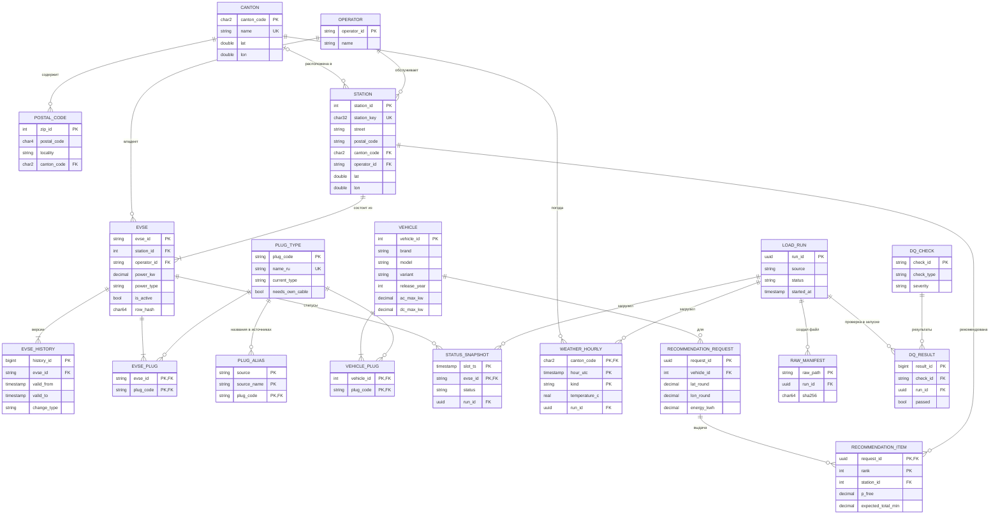

# ПР № 5. Логическая модель данных

Модель core и ops, приведённая к 3НФ. Связи M:N «точка — тип разъёма» и «автомобиль — тип разъёма» разрешены ассоциативными сущностями `EVSE_PLUG` и `VEHICLE_PLUG`. Полное описание атрибутов и ограничений сгенерировано из физической БД: [data_dictionary.md](../data_dictionary.md).

## Нормализация

- **1НФ:** атрибуты атомарны. Исключение — массив `filters` (jsonb) в журнале запросов: это неразбираемый снимок параметров запроса, по нему не выполняется поиск.
- **2НФ:** в таблицах с составным ключом (`evse_plug`, `vehicle_plug`, `status_snapshot`, `weather_hourly`) неключевые атрибуты зависят от всего ключа.
- **3НФ:** транзитивных зависимостей нет. Кантон станции хранится в `station`, а не в `evse`; оператор точки — в `evse` и `station`, потому что у точки может быть иной оператор, чем у станции (роуминговые операторы). Это обоснованное отступление от строгой 3НФ.
- **Обоснованная денормализация:** `evse.power_class` — вычисляемая колонка (GENERATED) от `power_type`, нужна для индексации и фильтров; витрины `mart.*` денормализованы намеренно под потребителей.
